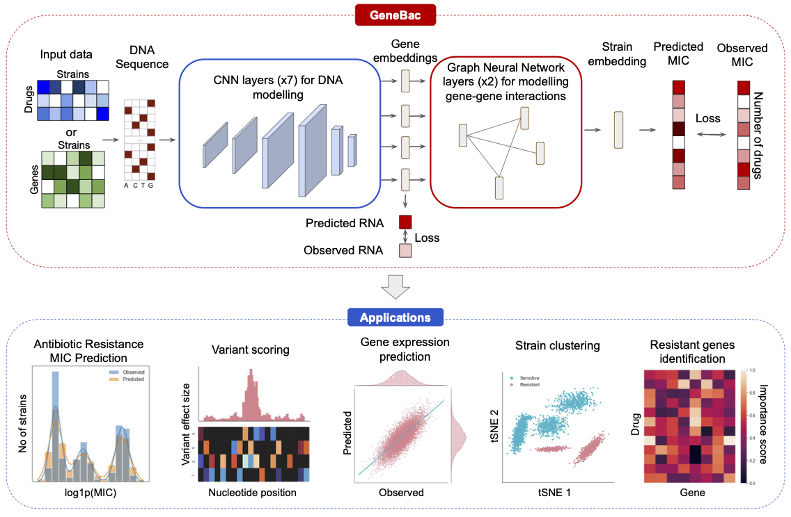

# GeneBac

[]()

GeneBac is a modular framework for predicting antibiotic resistance in bacteria from DNA sequence.
It takes as input the DNA sequence of selected genes with variants integrated into the sequence and outputs the predicted MIC to a set of drugs.
GeneBac can also be used for other tasks, including variant effect scoring, gene expression prediction, resistant genes identification, and strain clustering.

This repository contains the training and code for the GeneBac model described in "[Sequence-based modelling of bacterial genomes enables accurate antibiotic resistance prediction](input_text)".

<details open><summary><b>Table of contents</b></summary>

- [Installation](#installation)
- [Antibiotic Resistance Prediction](#abr)
  - [Training](#abr-training)
  - [Evaluation](#abr-evaluation)
- [Variant Effect Scoring](#variant-effect-scoring)
  - [Computing variant effect size for a single variant](#variant-effect-scoring-single-var)
  - [Computing variant effect size for a batch of variants](#variant-effect-scoring-batch-vars)
- [Gene Expression Prediction](#gene-expression-prediction)
  - [Training](#gene-expression-prediction-training)
  - [Evaluation](#gene-expression-prediction-evaluation)
- [Resistant Genes Identification](#resistant-genes-identification)
- [Strain Clustering](#strain-clustering)
- [Checkpoints](#checkpoints)
- [Citations](#citations)
- [License](#license)
</details>


## Installation <a name="installation"></a>

GeneBac is implemented in Python `3.9`. To setup with the repo with all dependencies, clone the repository locally and create
an environment, for example with `virtualenwrapper` or `conda`. To install the dependencies, navigate to the directory 
of the repository and run:
```bash
pip install .
```

## Antibiotic resistance prediction <a name="abr"></a>

### Training <a name="abr-training"></a>
To train the GeneBac model for antibiotic resistance prediction, run:
```bash
python deep_bac/train_gene_pheno.py \
  --regression \
  --input-dir <input_dir> \
  --output-dir <output_dir>
```
For other arguments like `batch size` etc., see `deep_bac/argparser.py` or run `python deep_bac/train_gene_pheno.py -h`. 
We provide a processed [CRyPTIC _Mycobacterium Tuberculosis_](http://ftp.ebi.ac.uk/pub/databases/cryptic/release_june2022/reproducibility/data_tables/cryptic-analysis-group/) dataset of `12,460` strains for training and evaluation on 
[Google drive](https://drive.google.com/file/d/1b8CgpIhaVQfyxqA6D3z05mNqsHeJW5T0/view?usp=sharing) (6.7 GB). The folder contains processed DNA sequences with variants integrated into the sequence as well as 
 training, test and cross-validation splits.

All the training were done with CUDA 10.2 on a single V100 or A100 GPU and takes less then 12 hours to train.

### Evaluation <a name="abr-evaluation"></a>
To evaluate the GeneBac model for antibiotic resistance prediction, run:
```bash
python deep_bac/train_gene_pheno.py \ 
  --test \
  --regression \
  --input-dir <input_dir> \
  --output-dir <output_dir> \
  --ckpt-path <path_to_the_trained_model_checkpoint>
```

## Variant effect scoring <a name="variant-effect-scoring"></a>

### Computing variant effect size for a single variant <a name="variant-effect-scoring-single-var"></a>
To compute variant effect scores for a single variant, run:
```bash
import ...


# load the trained model
model = load_trained_pheno_model(
  ckpt_path=<path_to_the_trained_model_checkpoint>,
  gene_interactions_file_dir=<input_dir_with_gene_interactions_file>,
  )

# compute the variant effect size
variant_effect_size = compute_variant_effect_size(
    model=model,
    gene=<gene_name>,
    variant=<variant>,
    start_idx=<start_idx>,
    end_idx=<end_idx>
)
```

### Computing variant effect size for a batch of variants <a name="variant-effect-scoring-batch-vars"></a>
It is also possible to compute variant effect scores for a batch of variants. 
To do it you firstly need to create a file with variants. An example file is provided in `files/variants.tsv`.
Then, run:
```bash
python deep_bac/experiments/variant_scoring/run_ism.py ...
```
## Gene Expression prediction <a name="gene-expression-prediction"></a>

### Training <a name="gene-expression-prediction-training"></a>

To train the GeneBac model for gene expression prediction, run:
```bash
python deep_bac/train_gene_expr.py \
  --input-dir <input_dir> \
  --output-dir <output_dir> \
  --lr 0.001 \
  --max-epochs 100 \
  --batch-size 256 \
  --monitor-metric val_r2
```
We provide a processed gene expression dataset of `386` _Pseudomonas aeruginosa_ strains 
on [Google drive](https://drive.google.com/file/d/1ZAzapi9C07E81spqxZBCEjATIJevEaor/view?usp=sharing) (220 MB), where each gene in a strain is a separate example. 
The folder contains processed DNA sequences with variants integrated into the sequence as well as 
 training, validation and test splits.

### Evaluation <a name="gene-expression-prediction-evaluation"></a>
To evaluate the model run:
```bash
python deep_bac/train_gene_expr.py \
  --input-dir <input_dir> \
  --output-dir <output_dir> \
  --batch-size 256 \
  --monitor-metric val_r2 \
  --ckpt-path <path_to_the_trained_model_checkpoint> \
  --test
```

## Resistant genes identification <a name="resistant-genes-identification"></a>
GeneBac can also be used to identify genes that are associated with antibiotic resistance to particular drugs.
We compute the association using the [DeepLift](https://arxiv.org/abs/1704.02685) algorithm. To compute the gene-drug scores
on a test set using a trained model, run:
```bash
python deep_bac/experiments/loci_importance/run_loci_importance.py \
  --input-dir <input_dir>  \
  --output-dir <output_dir> \
  --ckpt-path <path_to_the_trained_model_checkpoint>
```
Here, the `<input-dir>` can be the same as the one used for antibiotic resistance prediction.

## Strain clustering <a name="strain-clustering"></a>
To cluster strains, we compute the strain embeddings using a trained GeneBac model.
The embeddings can be then used for visualisation in two dimensions using a [tSNE](https://scikit-learn.org/stable/modules/generated/sklearn.manifold.TSNE.html) 
algorithm. To get the embeddings, run:
```bash
python deep_bac/experiments/latent_representations/latent_strain_representations.py
  --input-dir <input_dir> \
  --output-dir <output_dir> \
  --ckpt-path <path_to_the_trained_model_checkpoint>
```

## Checkpoints <a name="checkpoints"></a>
We provide trained model checkpoints for antibiotic resistance prediction on the CRyPTIC _Mycobacterium tuberculosis_ dataset
and gene expression prediction on the _Pseudomonas aeruginosa_ dataset. The checkpoints can be found in `files/checkpoints/`.

## Citations <a name="citations"></a>
If you find GeneBac useful in your work, please cite our paper:
```bibtex
```

## License <a name="license"></a>
GeneBac is licensed under the [MIT License](https://opensource.org/license/mit/).
